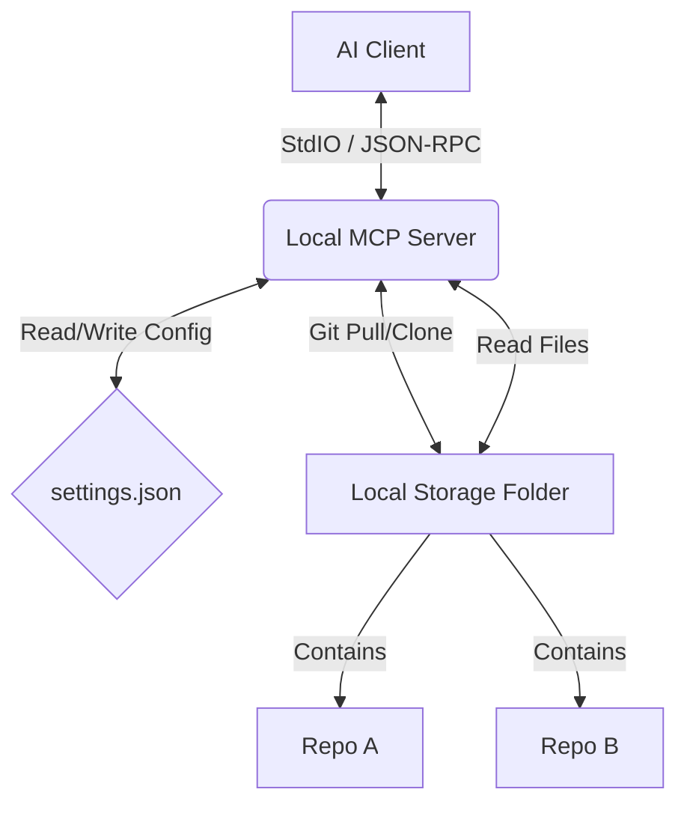

# 01 - System Architecture & Overview

## Project Goal

Create a local, offline-first Model Context Protocol (MCP) server that acts as a bridge between an AI Client (Claude Desktop, Cursor, etc.) and local git repositories/documentation.

## Tech Stack

- **Runtime:** Bun (or Node.js 20+)
- **Language:** TypeScript
- **Core Library:** `@modelcontextprotocol/sdk`
- **Git Operations:** `simple-git` (for managing local repos)
- **File Search:** `glob` or `fast-glob`
- **Validation:** `zod`

## System Architecture



## Directory Structure

```
my-local-mcp/
├── src/
│   ├── index.ts        # Entry point & Server setup
│   ├── config.ts       # Config loader (settings.json)
│   ├── tools/
│   │   ├── git.ts      # Git handlers (clone, pull)
│   │   └── files.ts    # File system handlers (read, search)
│   └── utils/
│       └── validation.ts
├── storage/            # Where repos will be cloned
├── settings.json       # Persistent config
├── package.json
└── tsconfig.json
```

## Configuration Schema (`settings.json`)

The application must maintain a JSON file to track added repositories.

```json
{
	"storagePath": "./storage",
	"repos": {
		"svelte-docs": {
			"url": "https://github.com/sveltejs/svelte",
			"branch": "main",
			"lastSync": "2024-02-20T10:00:00Z"
		}
	}
}
```
